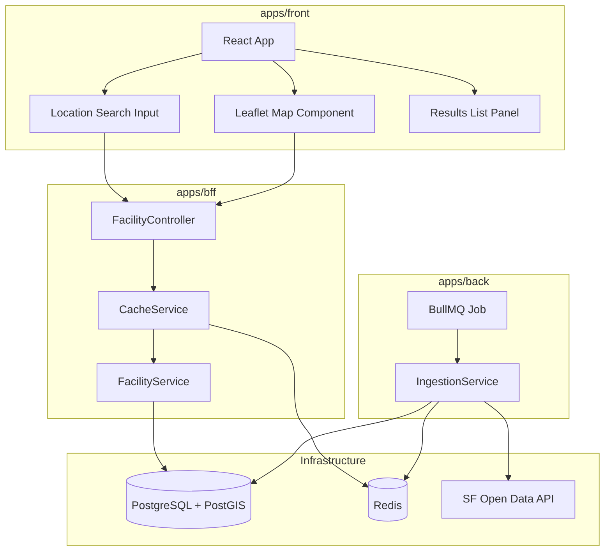

# Design Document: Food Truck Locator

## Overview

The Food Truck Locator feature enables users to discover mobile food facilities near a specific location in San Francisco. The system ingests permit data from the SF Open Data SODA API, stores it in PostgreSQL with PostGIS extensions for geospatial querying, and exposes it through a RESTful BFF API consumed by the React frontend.

The architecture follows the existing monorepo layered pattern:
- **apps/back** — Data ingestion service that fetches from SF Open Data SODA API and stores in PostgreSQL
- **apps/bff** — User-facing REST API providing geospatial search, filtering, and facility detail endpoints with Redis caching
- **apps/front** — React frontend with interactive Leaflet map, location search, and results list

Key design decisions:
1. **PostGIS for geospatial queries** — Uses `geography` type and `ST_DWithin` for accurate distance calculations in meters without coordinate transformation
2. **Redis caching with normalized keys** — Reduces database load for repeated queries; TTL-based expiration with active invalidation on data refresh
3. **SODA API direct ingestion** — Fetches all records at startup (dataset is ~500 records), stores locally for fast querying
4. **BullMQ for data ingestion** — Runs import as a queue job to avoid blocking service startup

## Architecture



### Data Flow

1. **Ingestion Flow**: Back service starts → BullMQ job triggers → Fetches from SODA API → Validates records → Upserts to PostgreSQL → Invalidates Redis cache
2. **Search Flow**: Frontend sends location + filters → BFF checks Redis cache → Cache miss queries PostGIS → Results cached and returned → Frontend renders map + list
3. **Detail Flow**: Frontend requests facility by permit ID → BFF returns full record (no caching needed for single-item lookups)

## Components and Interfaces

### apps/back — Ingestion Module

```
apps/back/src/
├── facility/
│   ├── facility.module.ts          # NestJS module registration
│   ├── facility.entity.ts          # TypeORM entity with PostGIS geography column
│   ├── ingestion.service.ts        # SODA API fetching, validation, upsert logic
│   ├── ingestion.service.spec.ts   # Unit tests
│   ├── ingestion.processor.ts      # BullMQ processor for import job
│   └── ingestion.processor.spec.ts # Unit tests
```

#### IngestionService

```typescript
interface IngestionService {
  importFacilities(): Promise<ImportResult>
  validateRecord(raw: SodaRecord): ValidationResult
}

interface ImportResult {
  imported: number
  skipped: number
  updated: number
  errors: string[]
}

interface ValidationResult {
  valid: boolean
  reason?: string
}
```

#### SODA API Response Shape

Based on the actual API response from `https://data.sfgov.org/resource/rqzj-sfat.json`:

```typescript
interface SodaRecord {
  objectid: string
  applicant: string
  facilitytype: string        // "Truck" | "Push Cart"
  address: string
  fooditems: string           // Comma-separated
  latitude: string            // String representation of decimal
  longitude: string           // String representation of decimal
  permit: string              // Unique permit identifier
  status: string              // "APPROVED" | "REQUESTED" | "SUSPEND" | "EXPIRED"
  blocklot: string
  block: string
  lot: string
  cnn: string
  schedule: string
  received: string
  priorpermit: string
  expirationdate: string
  location: {
    latitude: string
    longitude: string
    human_address: string
  }
}
```

### apps/bff — Facility API Module

```
apps/bff/src/
├── facility/
│   ├── facility.module.ts           # NestJS module registration
│   ├── facility.controller.ts       # REST endpoints with Swagger decorators
│   ├── facility.controller.spec.ts  # Controller unit tests
│   ├── facility.service.ts          # Business logic, geospatial queries
│   ├── facility.service.spec.ts     # Service unit tests
│   ├── facility-cache.service.ts    # Redis caching logic
│   ├── facility-cache.service.spec.ts
│   ├── dto/
│   │   ├── search-facilities.dto.ts       # Query param validation
│   │   ├── facility-response.dto.ts       # Response shape
│   │   └── facility-detail-response.dto.ts
│   └── index.ts                     # Barrel export
```

#### API Endpoints

| Method | Path | Description |
|--------|------|-------------|
| GET | `/api/facilities/search` | Geospatial search with optional filters |
| GET | `/api/facilities/:permitId` | Get facility by permit identifier |

#### SearchFacilitiesDto

```typescript
class SearchFacilitiesDto {
  @IsLatitude()
  latitude: number              // Required, -90 to 90

  @IsLongitude()
  longitude: number             // Required, -180 to 180

  @IsOptional()
  @Min(100) @Max(10000)
  radius?: number               // Default: 1000 meters

  @IsOptional()
  @MinLength(2)
  foodType?: string             // Comma-separated terms, each >= 2 chars

  @IsOptional()
  @IsIn(['Truck', 'Push Cart'])
  facilityType?: string         // Case-insensitive match
}
```

#### FacilityResponseDto

```typescript
class FacilityResponseDto {
  permitId: string
  applicant: string
  facilityType: string
  address: string
  foodItems: string | null
  latitude: number
  longitude: number
  permitStatus: string
  distance: number              // Meters from search point
}
```

### apps/front — Map & Search Components

```
apps/front/src/
├── features/
│   └── food-truck-locator/
│       ├── FoodTruckLocator.tsx       # Main page component
│       ├── components/
│       │   ├── MapView.tsx            # Leaflet map wrapper
│       │   ├── FacilityMarker.tsx     # Custom marker with popup
│       │   ├── SearchInput.tsx        # Address/coordinates input
│       │   ├── ResultsList.tsx        # Side panel list
│       │   ├── ResultCard.tsx         # Individual result item
│       │   ├── MapLegend.tsx          # Truck vs Push Cart legend
│       │   └── LoadingIndicator.tsx   # Spinner/skeleton
│       ├── hooks/
│       │   ├── useFacilitySearch.ts   # React Query hook for search
│       │   ├── useFacilityDetail.ts   # React Query hook for detail
│       │   └── useGeocoding.ts        # Address to coordinates
│       ├── services/
│       │   └── facilityApi.ts         # Axios API client
│       └── types/
│           └── facility.types.ts      # TypeScript interfaces
```

## Data Models

### Facility Entity (TypeORM + PostGIS)

```typescript
@Entity('facilities')
class FacilityEntity {
  @PrimaryColumn({ name: 'permit_id' })
  permitId: string

  @Column({ name: 'applicant' })
  applicant: string

  @Column({ name: 'facility_type' })
  facilityType: string              // "Truck" | "Push Cart"

  @Column({ name: 'address' })
  address: string

  @Column({ name: 'food_items', nullable: true })
  foodItems: string | null

  @Column('geography', {
    name: 'location',
    spatialFeatureType: 'Point',
    srid: 4326,
  })
  location: Point                   // PostGIS geography point

  @Column('decimal', { name: 'latitude', precision: 10, scale: 7 })
  latitude: number

  @Column('decimal', { name: 'longitude', precision: 10, scale: 7 })
  longitude: number

  @Column({ name: 'permit_status' })
  permitStatus: string              // "APPROVED" | "REQUESTED" | "SUSPEND" | "EXPIRED"

  @CreateDateColumn({ name: 'created_at' })
  createdAt: Date

  @UpdateDateColumn({ name: 'updated_at' })
  updatedAt: Date
}
```

### Database Migration

```sql
CREATE EXTENSION IF NOT EXISTS postgis;

CREATE TABLE facilities (
  permit_id VARCHAR(50) PRIMARY KEY,
  applicant VARCHAR(255) NOT NULL,
  facility_type VARCHAR(50) NOT NULL,
  address VARCHAR(255) NOT NULL,
  food_items TEXT,
  location GEOGRAPHY(Point, 4326) NOT NULL,
  latitude DECIMAL(10, 7) NOT NULL,
  longitude DECIMAL(10, 7) NOT NULL,
  permit_status VARCHAR(50) NOT NULL,
  created_at TIMESTAMP DEFAULT NOW(),
  updated_at TIMESTAMP DEFAULT NOW()
);

CREATE INDEX idx_facilities_location ON facilities USING GIST (location);
CREATE INDEX idx_facilities_permit_status ON facilities (permit_status);
CREATE INDEX idx_facilities_facility_type ON facilities (facility_type);
CREATE INDEX idx_facilities_food_items ON facilities USING GIN (to_tsvector('english', food_items));
```

### Geospatial Query Pattern

```sql
SELECT *,
  ST_Distance(location, ST_MakePoint(:lng, :lat)::geography) AS distance
FROM facilities
WHERE ST_DWithin(location, ST_MakePoint(:lng, :lat)::geography, :radius)
  AND permit_status = 'APPROVED'
  AND (:facilityType IS NULL OR LOWER(facility_type) = LOWER(:facilityType))
  AND (:foodType IS NULL OR LOWER(food_items) LIKE LOWER(:foodType))
ORDER BY distance ASC
LIMIT 50;
```

### Cache Key Structure

```
food-truck:search:<lat_4dp>:<lng_4dp>:<radius>:<foodType|none>:<facilityType|none>
```

Example: `food-truck:search:37.7749:-122.4194:1000:tacos:none`

Pattern for invalidation: `food-truck:search:*`

## Correctness Properties

*A property is a characteristic or behavior that should hold true across all valid executions of a system — essentially, a formal statement about what the system should do. Properties serve as the bridge between human-readable specifications and machine-verifiable correctness guarantees.*

### Property 1: Geospatial search returns only facilities within radius

*For any* valid latitude, longitude, and radius, all facilities returned by the search endpoint SHALL have a computed distance from the search point that is less than or equal to the specified radius.

**Validates: Requirements 2.1**

### Property 2: Search results are sorted by distance ascending

*For any* geospatial search result set with more than one facility, for every consecutive pair of facilities (i, i+1) in the result, the distance of facility i from the search point SHALL be less than or equal to the distance of facility i+1.

**Validates: Requirements 2.3**

### Property 3: Only APPROVED facilities are returned in search

*For any* search query (regardless of location, radius, or filters), all facilities in the response SHALL have a permit status of "APPROVED".

**Validates: Requirements 2.6**

### Property 4: Food type filter uses OR logic with case-insensitive partial match

*For any* set of valid food type terms (1 to 10 terms, each >= 2 characters, comma-separated), every facility in the results SHALL have a food items field that contains at least one of the provided terms as a case-insensitive substring.

**Validates: Requirements 3.1, 3.3**

### Property 5: Facility type filter is exact case-insensitive match

*For any* valid facility type filter value ("Truck" or "Push Cart"), all facilities in the results SHALL have a facility type that matches the filter value using case-insensitive comparison.

**Validates: Requirements 10.1**

### Property 6: Result set size is bounded to 50

*For any* geospatial search, the number of results returned SHALL be at most 50.

**Validates: Requirements 2.7**

### Property 7: Invalid coordinate or radius parameters are rejected

*For any* latitude outside [-90, 90], or longitude outside [-180, 180], or radius outside [100, 10000], the search endpoint SHALL return HTTP 400 with an error message indicating which parameter failed validation.

**Validates: Requirements 2.5**

### Property 8: Invalid food type filter values are rejected

*For any* food type query parameter that is empty, contains only whitespace, or where every comma-separated term is shorter than 2 characters, the search endpoint SHALL return HTTP 400.

**Validates: Requirements 3.4**

### Property 9: Invalid facility type values are rejected

*For any* facility type parameter value that is not "Truck" or "Push Cart" (case-insensitive), the search endpoint SHALL return HTTP 400 listing the valid options.

**Validates: Requirements 10.3**

### Property 10: Facility detail response includes all specified fields

*For any* facility stored in the database, requesting it by permit ID SHALL return a response containing all specified fields (applicant, facilityType, address, foodItems, latitude, longitude, permitStatus), with absent data represented as null rather than omitted.

**Validates: Requirements 4.1, 4.4**

### Property 11: Data ingestion upserts by permit identifier (no duplicates)

*For any* set of SODA records containing duplicate permit identifiers, after ingestion the database SHALL contain exactly one record per unique permit identifier.

**Validates: Requirements 1.5**

### Property 12: Ingestion validates coordinates and skips invalid records

*For any* batch of SODA records containing a mix of valid and invalid coordinates (null, zero, out-of-range), the ingestion process SHALL import all records with valid coordinates and skip all records with invalid coordinates, without stopping the overall import.

**Validates: Requirements 1.6, 1.7**

### Property 13: Ingestion maps all required fields

*For any* valid SODA record, after ingestion the stored entity SHALL contain all required fields: applicant name, facility type, address, food items, latitude, longitude, permit status, and permit identifier.

**Validates: Requirements 1.2**

### Property 14: Cache key normalization produces consistent keys

*For any* two search requests with coordinates that differ only beyond the 4th decimal place (less than ~11 meters apart), the generated cache keys SHALL be identical.

**Validates: Requirements 8.1**

### Property 15: Cache bypass on Redis failure returns valid results

*For any* search request where Redis is unavailable, the system SHALL still return valid results from the database without returning an error to the caller.

**Validates: Requirements 8.4**

### Property 16: Distance display formatting

*For any* facility in the results list, the displayed distance SHALL be the distance in miles rounded to one decimal place, and the food items summary SHALL be truncated to 80 characters with an ellipsis appended when the original exceeds 80 characters.

**Validates: Requirements 7.2**

## Error Handling

### Back Service (Ingestion)

| Scenario | Behavior |
|----------|----------|
| SODA API unreachable | Retry 3 times with exponential backoff (2s, 4s, 8s). Log error each attempt. |
| All retries exhausted | Log critical error. Service starts with stale/empty data. |
| Individual record validation fails | Skip record, log warning with permit ID and reason. Continue import. |
| PostgreSQL connection failure during import | Job fails, BullMQ retries per queue configuration. |
| PostGIS extension not available | Fail startup with clear error message. |

### BFF Service (API)

| Scenario | Behavior |
|----------|----------|
| Invalid query parameters | Return HTTP 400 with specific validation error messages (which param, what constraint). |
| Facility not found by permit ID | Return HTTP 404 with message including the requested ID. |
| Malformed/empty permit ID | Return HTTP 400 with format guidance. |
| Redis unavailable (read) | Bypass cache, query database directly. Log warning. |
| Redis unavailable (write) | Skip cache write. Log warning. Return response normally. |
| Database query timeout | Return HTTP 503 with retry guidance. |
| Internal server error | Return HTTP 500 with generic message. Log full stack trace. |

### Frontend

| Scenario | Behavior |
|----------|----------|
| Geocoding fails | Display error message "Could not find that address." Preserve user input. |
| Geocoding timeout (> 5s) | Display error, preserve input. |
| API request fails | Display error state in list panel. Map remains at last valid state. |
| Zero results | Show map centered on search location, no markers, "No food trucks found" message. |
| Invalid coordinate input | Display validation error before making API call. |

## Testing Strategy

### Property-Based Testing

**Library**: `fast-check` (integrated with Jest 29)

Property-based tests validate the correctness properties defined above. Each property test runs a minimum of 100 iterations with randomly generated inputs. Each test is tagged with the corresponding property reference.

**Configuration**:
- Minimum 100 iterations per property test (`fc.assert(property, { numRuns: 100 })`)
- Each test tagged: `Feature: food-truck-locator, Property {N}: {description}`
- Property tests implemented as single `it` blocks using `fc.assert` with `fc.asyncProperty` or `fc.property`

**Key generators needed**:
- `arbitraryCoordinate()` — Valid latitude [-90, 90] and longitude [-180, 180]
- `arbitraryInvalidCoordinate()` — Out-of-range latitude/longitude values
- `arbitraryRadius()` — Valid range [100, 10000]
- `arbitraryInvalidRadius()` — Outside valid range
- `arbitraryFoodTypeTerm()` — String of length >= 2
- `arbitraryInvalidFoodType()` — Empty, whitespace-only, or all terms < 2 chars
- `arbitraryFacilityType()` — "Truck" | "Push Cart"
- `arbitraryFacilityRecord()` — Full valid facility conforming to entity schema
- `arbitrarySodaRecord()` — SODA API response with optional invalid coordinates
- `arbitraryPermitId()` — Valid permit identifier string

**Property-to-test mapping**:
- Properties 1-9: `apps/bff/src/facility/facility.service.spec.ts` and `facility.controller.spec.ts`
- Property 10: `apps/bff/src/facility/facility.controller.spec.ts`
- Properties 11-13: `apps/back/src/facility/ingestion.service.spec.ts`
- Property 14: `apps/bff/src/facility/facility-cache.service.spec.ts`
- Property 15: `apps/bff/src/facility/facility-cache.service.spec.ts`
- Property 16: `apps/front/src/features/food-truck-locator/components/ResultCard.spec.tsx`

### Unit Testing

Unit tests focus on specific examples and edge cases that complement property tests:

- **IngestionService**: Retry behavior with exponential backoff (mocked HTTP), critical error logging on exhausted retries, service startup without data
- **FacilityService**: Default radius of 1000m when omitted, empty result returns 200, PostGIS query construction
- **FacilityCacheService**: Cache hit returns without DB query, cache miss stores with 300s TTL, invalidation after import
- **FacilityController**: Swagger decorator presence, 404 for unknown permit ID, 400 for malformed permit ID
- **DTOs**: class-validator decorator behavior with boundary values

### Integration Testing

- **PostGIS queries**: Seed facilities at known coordinates, verify distance calculations are accurate to within 1 meter
- **Redis caching**: Full set/get/invalidate lifecycle with real Redis
- **API E2E**: Supertest against running BFF with seeded PostgreSQL + PostGIS, test full request/response cycle
- **Data ingestion**: Real SODA API fetch (or recorded fixtures) through full import pipeline

### Frontend Testing

- **Component tests** (React Testing Library): Map rendering with markers, popup content, results list ordering, loading states, error messages
- **Hook tests**: `useFacilitySearch` and `useGeocoding` behavior with mocked Axios responses
- **Formatting tests**: Distance conversion to miles, food items truncation logic
- **Interaction tests**: Map click triggers search, result card click highlights marker
